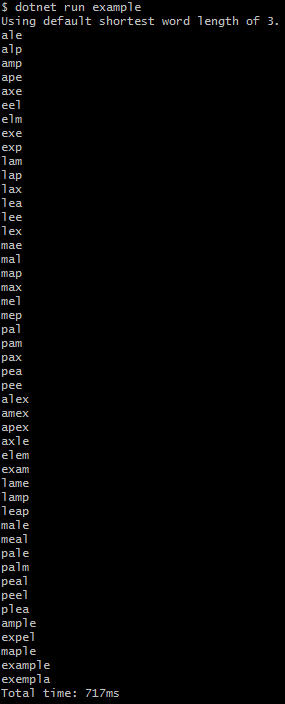

# WordSolver
*A solver for word-permutation games like Wordscapes and Word Cookies*



Some of the "words" may not be recognizable as actual English words; this is a function of the dictionary, not the solver. A different dictionary may provide more satisfactory results.

### Installation
You just need the [.NET Core Runtime](https://www.microsoft.com/net/download). It runs on Windows, OSX, and Linux.

### Usage
From the `WordSolver.CLI` folder:
```
# To use default word minimum word length of 3
dotnet run {letters}

# To specify minimum word length
dotnet run {letters} [minimum_word_length]

# Examples...
dotnet run abcdef
dotnet run jkloics 4
dotnet run qwertyu 5
```

### WebAPI/Docker
There is also an ASP.NET Core WebAPI in `WordSolver.WebAPI`. No front-end is currently included. You can build and run it with docker:
```
docker build -t wordsolver .
docker run --rm -it -p 8080:80 wordsolver
```

Then visit the API in Postman or a browser: `localhost:8080/abcdefg`

You can also go into the `WordSolver.WebAPI` folder and run it without Docker, but be sure to use Development mode so that the `wordlist.txt` file is found:

```
cd WordSolver.WebAPI
ASPNETCORE_ENVIRONMENT="Development" dotnet run # Runs on port 5000 (http) and 5001 (https)
```

### Performance
This code is not highly optimized, but it is parallelized using LINQ's `AsParallel()` method. On a non-overclocked Core i5-6600K, it takes about 1.2s to run `abcdefg` and 11s to run `abcdefgh` with the default minimum word length of 3.

The `wordlist.txt` wordlist is from [gwicks.net](http://gwicks.net/dictionaries.htm). I have added a few words to it (e.g. "blog"). I claim no copyright over this list.
